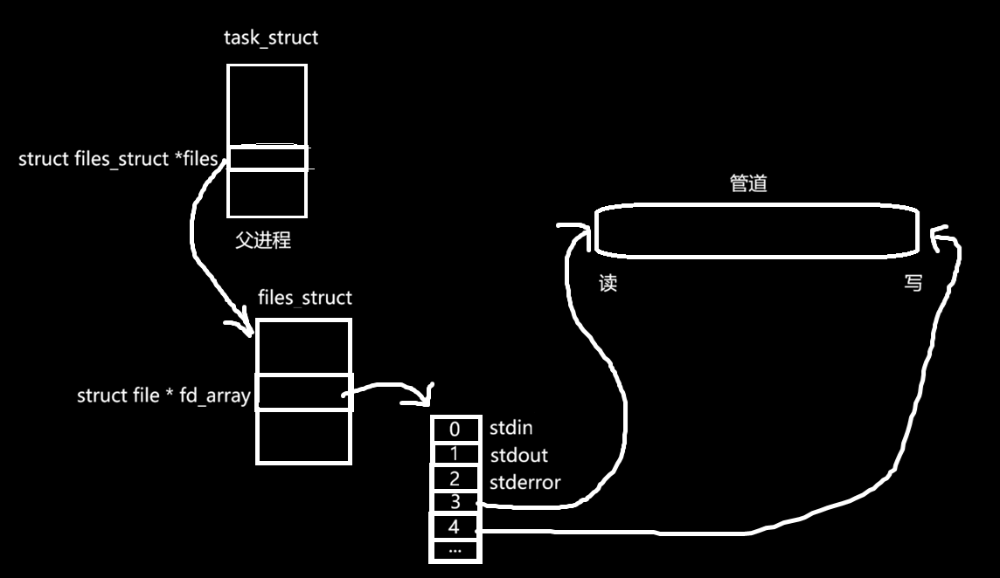
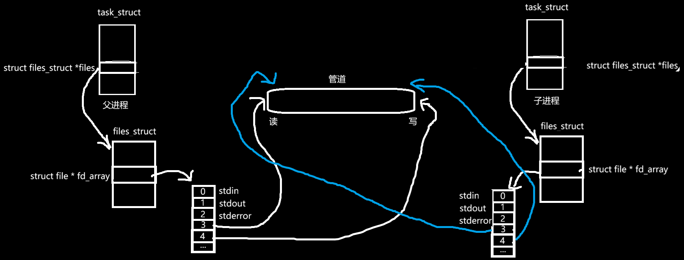
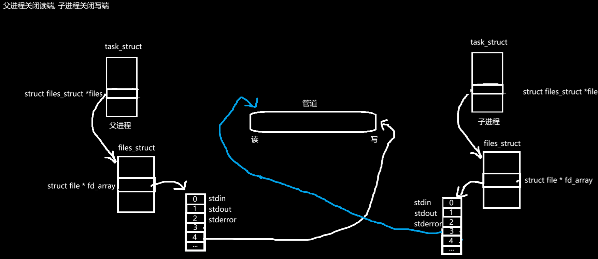

# 进程间通信（Inter-Process Communication, IPC）

## 进程间通信的引入

<!-- 目的：理解进程通信的概念，知道什么是进程间通信，为什么要进程间通信，怎么实现进程间通信 -->


<!-- 
题纲：

1. 引出进程间通信的必要性，一定要给实例，说白话。
2. 用形象的例子说明进程通信是干什么的，它有哪些好处？
3. 明白了是什么和为什么这两个首要问题之后，我就可以介绍如何在进程间通信了。
4. 说明进程间通信的前提：由于独立性的限制，通信的成本比较高。而通信，必须满足两个进程必须要能看到同一份资源这个前提条件。
5. 引出管道：如何让两个进程看到同一份资源呢？我们知道，fork()在创建子进程的时候会拷贝父进程的`task_struct` 而在这个结构中，就有文件描述符。又因为同一份文件，被多个进程打开只需要在内存中存在一份 `struct file` 类型的结构体（因为多个进程打开同一份文件改引用计数即可）所以在刚创建好父子进程后，父子进程的fd会指向相同的文件。此时，我们就有了同一份资源。……回来再写


最后一步: 综合实例: 进程间通信C/S端, 使用管道, System V共享内存

 -->

为什么进程间需要通信？什么是进程间通信？

初学系统编程时，听到“进程间通信”这样的概念总觉得很抽象。其实完全可以把它想象成几个人在一起做项目——每个人（进程）各司其职（进程的独立性）。但总有一些时间需要相互传一下资料，对一下进度，否则项目就推不动。

而在Linux中，完成某项任务时，进程之间需要互相交流，以确保任务更高效地完成。我相信大家一定见过甚至熟悉下面这些例子吧：

```bash
ps -ajx | grep a.out
```

这行指令的意思是：查看在操作系统上所有的进程及其信息，并筛选出进程信息中包含 `a.out` 的行。这是一次完美的配合！`ps -ajx` 向屏幕上打印进程信息，再通过**管道**（进程间通信的一种方式）传递给 `grep` 指令筛选信息。如果不使用这种进程间通信的手段的话，我可能需要：

```bash
ps -ajx >> process.txt
vim process.txt
/a.out
```

还挺麻烦的不是？

正如大家所见，这种进程之间“打配合”的方式就是进程间通信（IPC）。

而众多IPC方式中, 我们先介绍管道. 而管道又分为命名管道和匿名管道, 为什么要这么叫呢? 这两个名词一摆上来, 直觉就告诉我们, 它们的区别就是一个有名字, 一个没有名字. 事实上也确实如此, 命名管道是一个存在在磁盘上的文件, 可以让任意两个进程之间通信. 而匿名管道是一个内存级文件, 它并不存放在磁盘上, 与其说文件, 不如说它更像一个缓冲区. 

## 匿名管道

生活中的管道, 如水管, 它们都有一个特点: 一头进, 一头出. 而进程通信中的管道也满足这一特性. 它们通常只是一头到另一头的, 比如自来水只会通过水管进入家中, 而不会反过来. 为什么叫它管道? 因为它是单向通信的.

管道通信方式, 基于文件系统. 所以我们可以在管道通信的代码中看到 `open()`, `write()` 这样的系统调用. 它本质上就是对文件的操作. 

### 创建匿名管道

要使用管道, 首先要有管道可用. 所以我们第一步, 就是要创建一个管道. 那么如何创建管道? 管道是什么? 文件! 创建文件需要申请系统和硬件的资源, 所以我们需要直接或间接地通过系统调用来创建管道. 接下来, 就来介绍一下创建管道的系统调用: `pipe()` 系统调用. 我们先来看看它的原型:

```c
int pipe(int pipefd[2]);
```

作用: 创建管道, 并把管道的读写端文件描述符, 存放到 `pipefd[]`数组中.

参数:
- pipefd[0]: 读端文件描述符
- pipefd[1]: 写端文件描述符

返回值:

- 成功时: 返回0
- 失败时: 返回-1, errno记录错误信息

> 巧记: 0想象成口, 1想象成笔. 口的作用就是读, 对应读端; 笔的作用就是写, 对应写端. 三天不读口生, 三天不写手生嘛.

哇, 这么简洁的接口用起来一定很容易罢(喜). 是的, 使用它确实不难. 我们来上一个实例.

**实例:** 在进程中创建一个管道, 并打印它的读写端文件描述符.

```c
#include <stdio.h>
#include <assert.h>
#include <unistd.h>

int main(void) {
    int fds[2];
    int ret = pipe(fds);
    assert(ret == 0);

    printf("Pipe Read fds[0]: %d\n", fds[0]);
    printf("Pipe Write fds[1]: %d\n", fds[1]);

    return 0;
}
```

编译并运行可得输出:

```bash
vivit@Xen:test_pipe$ ./a.out 
Pipe Read fds[0]: 3
Pipe Write fds[1]: 4
vivit@Xen:test_pipe$ 
```

此时我们可以看到, 文件描述符3处存放了管道读端的地址, 而文件描述符4处存放了管道写端的地址. 这是什么奇怪的说法? 让我们来复习一下文件I/O相关的内容罢. 

如图, 我们创建管道时, `pipe()` 系统调用创建了管道文件, 而这个管道文件的读端和写端的地址被放在了该进程的文件描述符表的3, 4下标的位置:

<!--  -->


### 匿名管道使用

好, 现在管道有了, 那么我应该怎么用它呢? 还记得文件I/O的系统调用接口吧. 管道通信的本质就是:

- 负责写的进程使用 `write()`系统调用向 `fds[1]` 指向的文件, 即管道写端去**写入文件**
- 负责读的进程使用 `read()` 系统调用从 `fds[0]` 指向的文件, 即管道读端却**读取文件内容**

**实例:** 让进程自己与自己通信, 写端负责向管道里写内容, 而读端负责将内容读出, 并打印在显示器上

```c
#include <stdio.h>
#include <stdlib.h>
#include <assert.h>
#include <string.h>
#include <unistd.h>
#include <fcntl.h>

#define MAX 128

int main(void) {
    int fds[2];
    int ret = pipe(fds);
    assert(ret == 0);

    int cnt = 1;
    char * bufWrite = (char *)malloc(sizeof (char) * MAX);
    char * bufRead = (char *)malloc(sizeof (char) * MAX);

    while (cnt <= 5) {
        //向bufWrite缓冲区中格式化写入自定义的字符串
        snprintf(bufWrite, MAX, "第%d条消息", cnt++);
        //将bufWrite中的内容写入到管道
        write(fds[1], bufWrite, strlen(bufWrite));

        //读出管道中的内容写入到bufRead缓冲区中
        ssize_t r = read(fds[0], bufRead, MAX -1);
        if (r > 0) {
            //读取成功, 在读到的最后一个字符后加上'\0'防止C/C++无法识别到结尾
            bufRead[r] = '\0';
        }
        //打印
        printf("%s\n", bufRead);
        //慢一点
        sleep(1);
    }


    close(fds[0]);
    close(fds[1]);
    free(bufWrite);
    free(bufRead);

    return 0;
}
```

编译并执行, 有如下输出:

```bash
vivit@Xen:test_pipe$ ./a.out 
第1条消息
第2条消息
第3条消息
第4条消息
第5条消息
```

好, 刚才我们演示了一次管道的用法. 但这只是一个进程对管道的读写两端进行的读写操作, 没有涉及到多个进程. 而进程间通信是要解决多个进程之间数据交换的的. 

进程间通信的成本是较高的, 因为进程之间具有独立的地址空间, 甚至互相之间完全感知不到对方的存在. 即使是父子进程, 也有着独立的地址空间, 虽然它们的内容从最开始是相同的. 那么问题来了, 既然进程之间看不到对方, 那要怎么通信? 通信的前提是要被看见, 那就找一个需要通信的进程都能看到的公共资源, 然后让进程通过这个公共资源来完成通信不就OK了?

那问题来了, 如何让不同的进程, 看到相同的空间呢? 唉, 还记不记得进程创建时用到的 `fork()` 系统调用? 而使用 `fork()` 系统调用创建子进程的话, 父子进程的文件描述符表内容是完全一样的, 这也就意味着, 它们指向的文件在最开始是相同的. 因为文件对象不会被复制, 在整个系统中只有一份, 它是通过 "计数器" 的形式来管理的, 有一个进程打开了它就计数器 +1, 一个进程释放了它就计数器 -1.

所以现阶段我们完全能够做到让父子进程看到同一份资源了: 父进程先创建一个管道, 再创建一个子进程, 此时父子进程就具备了使用同一个管道文件来完成进程间通信基础.

**实例:** 创建一个管道文件, 再创建一个子进程, 并打印父子进程的fds[]

```c
#include <stdio.h>
#include <assert.h>
#include <unistd.h>
#include <fcntl.h>

int main(void) {
    int fds[2];
    int ret = pipe(fds);
    assert(ret == 0);

    int id = fork();
    assert(id >= 0);

    //子进程
    if (id == 0) {
        printf("Child: %d Pipe Read fds[0]: %d\n", getpid(), fds[0]);
        printf("Child: %d Pipe Write fds[1]: %d\n", getpid(), fds[1]);
    }
    else {
        //父进程
        printf("Parent Pipe Read fds[0]: %d\n", fds[0]);
        printf("Parent Pipe Write fds[1]: %d\n", fds[1]);
    }


    return 0;
}
```

此时，父子进程与管道的关系如下图所示：

<!--   -->


而管道是“一头进，一头出”的，在这里，我们让父进程向管道中写数据，让子进程从管道中读数据。我们需要先通过 `close()` 系统调用把父进程的读端关掉，把子进程的写端关掉。而在这之后，我们就可以正常地向管道中读写数据了。

**实例:** 父进程写数据, 子进程读数据.

我们让父进程管道中写五行数据, 每过一秒就写一次, 而子进程也是每过一秒读一次.

```c
#include <stdio.h>
#include <string.h>
#include <assert.h>
#include <unistd.h>
#include <sys/wait.h>
#define MAX 1024    

int main() {
    int fds[2];
    int ret = pipe(fds);
    assert(ret == 0);
    (void)ret;

    int id = fork();
    assert(id >= 0);
    if (id == 0) {
        //子进程关掉写端, 读数据
        close(fds[1]);
        char buf[MAX];
        int cnt = 1;
        while (cnt <= 5) {
            ssize_t r = read(fds[0], buf, sizeof buf);
            if (r > 0) {
                buf[r] = '\0';
            }
            printf("子进程收到: %s\n", buf);
            sleep(1);
            cnt++;
        } 
    }
    else {
        //父进程关闭读端, 写数据
        close(fds[0]);
        char buf[MAX];
        //如果buf使用指针动态分配内存的话, 这里不能直接用sizeof, 而要用MAX
        //向buf中写数据
        int cnt = 1;
        while (cnt <= 5) {
            snprintf(buf, sizeof buf, "父进程写了第 %d 份", cnt);
            //write()的本质, 把用户缓冲区的数据拷贝至内核缓冲区, 并适时刷向文件
            write(fds[1], buf, strlen(buf));
            sleep(1);
            cnt++;
        }

        waitpid(id, NULL, 0);
    }

    return 0;

}
```

输出结果:

```bash
vivit@Xen:test_pipe$ make
gcc -g Test.c Pipe.c -o a.out
vivit@Xen:test_pipe$ ./a.out 
子进程收到: 父进程写了第 1 份
子进程收到: 父进程写了第 2 份
子进程收到: 父进程写了第 3 份
子进程收到: 父进程写了第 4 份
子进程收到: 父进程写了第 5 份
```

我们可以看到, 父子进程很好地完成了任务. 顺带一提, 父子进程的 `close()` 系统调用执行之后, 管道就会变成这样, 一头读, 一头写:

<!--  -->
